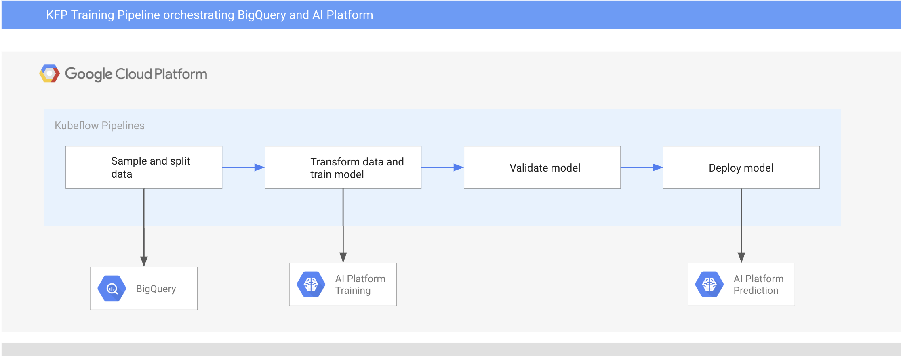

# Orchestraiting model training and deployment with KFP and Cloud AI Platform

Developing a repeatable and reliable ML pipeline is a complex, multi-step process.

In most cases, you start by exploring the datasets and experimenting with data preprocessing and modeling routines in an interactive environment like Jupyter notebooks. When you zero in on a given approach you formalize your workflow by authoring an ML pipeline.

Today, the process of transitioning from an interactive notebook to an operationalized pipeline is not fully automated. You need to manually re-factor your code snippets in the notebook to ML Pipeline DSL. There is ongoing work in TFX and KFP initiatives to make the process more streamlined and eventually fully automated.

In this lab, you simulate this process by walking through the development of a KFP pipeline that orchrestrates BigQuery and Cloud AI Platform services to train and deploy a **scikit-learn model**:

1. In Part 1 of the lab, you work in a Jupyter notebook to explore the data, prepare data extraction routines, and experiment with training and hyperparameter tuning code.

2. In Part 2, you re-factor code snippets developed in the notebook into KFP components and a KFP pipeline.

## Lab scenario

In the lab, you will use the [Covertype Data Set](../datasets/covertype/README.md) to develop a multi-class classification model that predicts the type of forest cover from cartographic data. 

The source data is in BigQuery. The pipeline uses BigQuery to prepare training and evaluation splits, AI Platform Training to run a custom container with data preprocessing and training code, and AI Platform Prediction as a deployment target. The below diagram represents the workflow orchestrated by the pipeline.

.

## Lab setup

### AI Platform Notebook configuration
You will use the **AI Platform Notebooks** instance configured with the `tf115-tfx015-kfp137` image. To prepare the lab:
1. Create/use the **AI Platform Notebook** instance using the process described in [Lab-00-Environment-Setup](../Lab-00-Environment-Setup/README.md).
2. Open **JupyterLab** in your instance


### Lab dataset
This lab uses the [Covertype Dat Set](../datasets/covertype/README.md). The pipeline developed in the lab sources the dataset from BigQuery. Before proceeding with the lab upload the dataset to BigQuery:

1. Open new terminal in you **JupyterLab**
2. Clone this repo in the `home` folder
```
cd /home
git clone https://github.com/jarokaz/mlops-labs.git
```

3. Navigate to the datasets folder and upload the dataset to BigQuery
```
cd mlops-lab/datasets/covertype

PROJECT_ID=[YOUR_PROJECT_ID]
DATASET_LOCATION=US
DATASET_ID=lab_12
TABLE_ID=covertype
DATA_SOURCE=covertype.csv
SCHEMA=Elevation:INTEGER,\
Aspect:INTEGER,\
Slope:INTEGER,\
Horizontal_Distance_To_Hydrology:INTEGER,\
Vertical_Distance_To_Hydrology:INTEGER,\
Horizontal_Distance_To_Roadways:INTEGER,\
Hillshade_9am:INTEGER,\
Hillshade_Noon:INTEGER,\
Hillshade_3pm:INTEGER,\
Horizontal_Distance_To_Fire_Points:INTEGER,\
Wilderness_Area:STRING,\
Soil_Type:INTEGER,\
Cover_Type:INTEGER

bq --location=$DATASET_LOCATION --project_id=$PROJECT_ID mk --dataset $DATASET_ID

bq --project_id=$PROJECT_ID --dataset_id=$DATASET_ID load \
--source_format=CSV \
--skip_leading_rows=1 \
--replace \
$TABLE_ID \
$DATA_SOURCE \
$SCHEMA
```

### AI Platform job dir bucket
```
BUCKET_NAME=gs://lab_12_bucket
gsutil mb -p $PROJECT_ID $BUCKET_NAME
```

## Lab Part 1 - Experimentation
## Lab Part 2 - Operationalization


