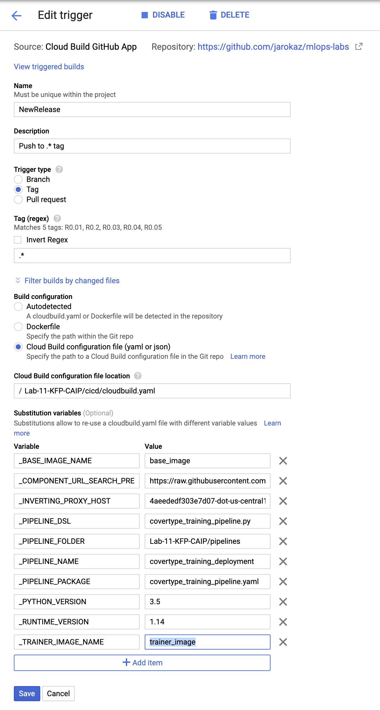

# CI/CD for KFP pipelines

In this lab you will walk through authoring of a **Cloud Build** CI/CD workflow that automatically builds and deploys a KFP pipeline.

you will also integrate your workflow with **GitHub** by setting up a trigger that starts the  workflow when a new tag is applied to the **GitHub** repo hosting the pipeline's code.

## Lab scenario

This lab uses the KFP DSL and KFP components developed in `lab-12-kfp-pipeline`.

## Lab setup

This lab requires the same setup as `lab-12-kfp-pipeline`. If you completed `lab-12-kfp-pipeline` you are ready to go and you can skip to the **Lab Exercises** section.

### AI Platform Notebook configuration
Before proceeding with the lab, you must set up an AI Platform Notebook instance and a KFP environment as detailed in `lab-01-environment-notebook` and `lab-02-environment-kfp`

### Lab dataset
This lab uses the [Covertype Dat Set](../datasets/covertype/README.md). The pipeline developed in the lab sources the dataset from BigQuery. Before proceeding with the lab upload the dataset to BigQuery. 

1. Open new terminal in you **JupyterLab**

2. Create the BigQuery dataset and upload the `covertype.csv` file.
```
PROJECT_ID=[YOUR_PROJECT_ID]
DATASET_LOCATION=US
DATASET_ID=lab_11
TABLE_ID=covertype
DATA_SOURCE=gs://workshop-datasets/covertype/full/covertype.csv
SCHEMA=Elevation:INTEGER,\
Aspect:INTEGER,\
Slope:INTEGER,\
Horizontal_Distance_To_Hydrology:INTEGER,\
Vertical_Distance_To_Hydrology:INTEGER,\
Horizontal_Distance_To_Roadways:INTEGER,\
Hillshade_9am:INTEGER,\
Hillshade_Noon:INTEGER,\
Hillshade_3pm:INTEGER,\
Horizontal_Distance_To_Fire_Points:INTEGER,\
Wilderness_Area:STRING,\
Soil_Type:INTEGER,\
Cover_Type:INTEGER

bq --location=$DATASET_LOCATION --project_id=$PROJECT_ID mk --dataset $DATASET_ID

bq --project_id=$PROJECT_ID --dataset_id=$DATASET_ID load \
--source_format=CSV \
--skip_leading_rows=1 \
--replace \
$TABLE_ID \
$DATA_SOURCE \
$SCHEMA
```

### GCS bucket
Create the GCS bucket that will be used as a staging area during the lab.
```
BUCKET_NAME=gs://${PROJECT_ID}-lab-11
gsutil mb -p $PROJECT_ID $BUCKET_NAME
```
## Lab Exercises

Follow the instructor who will walk you through the lab. The high level summary of the lab exercises is as follows.

###  Authoring the CI/CD workflow that builds and deploy a KFP  pipeline

In this exercise you walk-through authoring a **Cloud Build** CI/CD workflow that automatically builds and deploys a KFP pipeline. The **Cloud Build** configuration uses both standard and custom [Cloud Build builders](https://cloud.google.com/cloud-build/docs/cloud-builders). The custom builder, which you build in the first part of the exercise, encapsulates **KFP CLI**. 

*The current version of the lab has been developed and tested with v1.36 of KFP. There is a number of issues with post 1.36 versions of KFP that prevent us from upgrading to the newer version of KFP. KFP v1.36 does not have support for pipeline versions. As an interim measure, the **Cloud Build**  workflow appends ``$TAG_NAME` default substitution to the name of the pipeline to designate a pipeline version. 

To create a **Cloud Build** custom builder that encapsulates KFP CLI.

1. Create the Dockerfile describing the KFP CLI builder
```
cat > Dockerfile << EOF
FROM gcr.io/deeplearning-platform-release/base-cpu
SHELL ["/bin/bash", "-c"]
RUN apt-get update -y && apt-get -y install kubectl
RUN RELEASE=0.1.36 \
&& pip install https://storage.googleapis.com/ml-pipeline/release/$RELEASE/kfp.tar.gz 

ENTRYPOINT ["/bin/bash"]
EOF
```

2. Build the image and push it to your project's Container Registry
```
PROJECT_ID=$(gcloud config get-value core/project)
IMAGE_NAME=kfp-cli
TAG=latest

IMAGE_URI="gcr.io/${PROJECT_ID}/${IMAGE_NAME}:${TAG}"

gcloud builds submit --timeout 15m --tag ${IMAGE_URI} .
```


3. Update the `build_pipeline.sh` script in the `Lab-11-KFP-CAIP/cicd` folder with your KFP inverting proxy host. You can retrieve the inverting proxy host name from the `inverse-proxy-config` ConfigMap. It will be under the `Hostname` key.
4. Manually trigger the CI/CD build:
```
./build_pipeline.sh
```
### Exercise 4 - Setting up GitHub integration
In this exercise you integrate your CI/CD workflow with **GitHub**, using [Cloud Build GitHub App](https://github.com/marketplace/google-cloud-build). 
You will set up a trigger that starts the CI/CD workflow when a new tag is applied to the **GitHub** repo managing the KFP pipeline source code. You will use a fork of this repo as your source GitHub repository.

1. [Follow the GitHub documentation](https://help.github.com/en/github/getting-started-with-github/fork-a-repo) to fork this repo
2. Connect the fork you created in the previous step to your Google Cloud project and create a trigger following the [Creating GitHub app trigger](https://cloud.google.com/cloud-build/docs/create-github-app-triggers) article. Configure your trigger using the below configuration as a template:



Use the following values for the substitution variables:

|Variable|Value|
|--------|-----|
|_BASE_IMAGE_NAME|base_image|
|_COMPONENT_URL_SEARCH_PREFIX|https://raw.githubusercontent.com/kubeflow/pipelines/0.1.38/components/gcp/|
|_INVERTING_PROXY_HOST|[Your inverting proxy host]|
|_PIPELINE_DSL|covertype_training_pipeline.py|
|_PIPELINE_FOLDER|Lab-11-KFP-CAIP/pipelines|
|_PIPELINE_NAME|covertype_training_deployment|
|_PIPELINE_PACKAGE|covertype_training_pipeline.yaml|
|_PYTHON_VERSION|3.5|
|_RUNTIME_VERSION|1.14|
|_TRAINER_IMAGE_NAME|trainer_image|


3. To start an automated build [create a new release of the repo in GitHub](https://help.github.com/en/github/administering-a-repository/creating-releases).

### Exercise 5 - Integrating the KFP pipeline with the upstream data management pipeline
